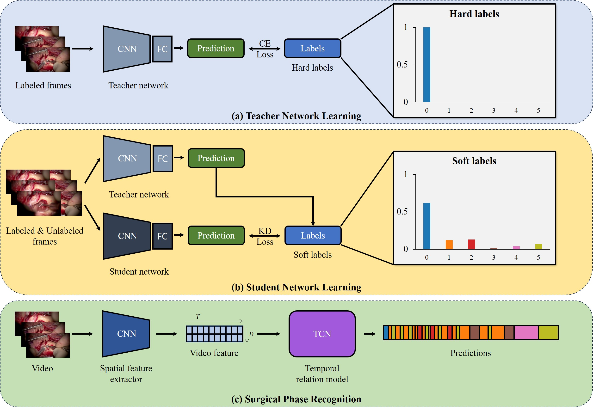

# TMRecognition
TMRecognition is a model for Tympanomastoidectomy Surgical Phase Recognition using deep learning.

## Overview



## Feature Extractor Training & Feature Extraction

For teacher network
```python
python train.py -c configs/train/ent_6class_labeled.json
```
For student network
```python
python train.py -c configs/train/ent_6class_soft_pseudo.json
```
For feature extraction
```python
python feature_extraction.py -c configs/test/ent_6class_soft_pseudo_train.json
```

## Surgical Phase Recognition Training & Prediction

For surgical phase recognition Network
```python
python main.py --action=hierarch_train --model=Hierarch_CausalTCN --name=soft_pseudo --cuda_visible_devices=0
```
```python
python main.py --action=hierarch_predict --model=Hierarch_CausalTCN --name=soft_pseudo --cuda_visible_devices=0
```
